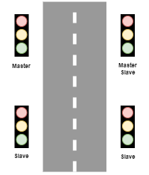
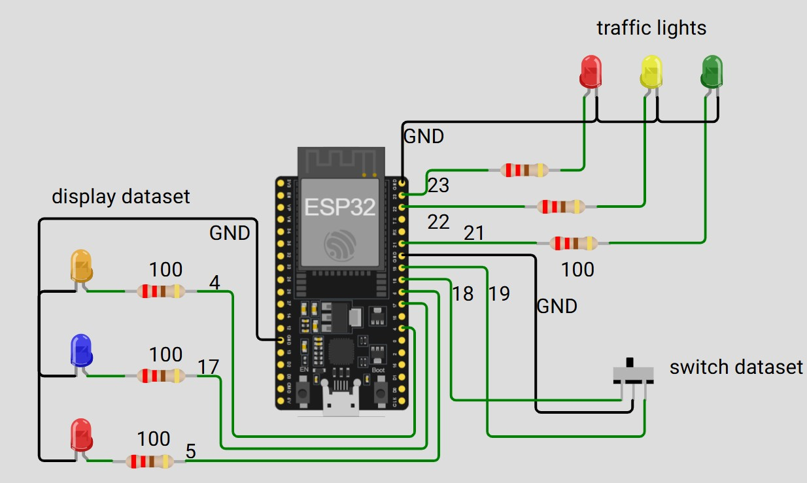

Funkgesteuerte Baustellenampel / Modellbau
=========================================

Kurzbeschreibung
-----------------
Dieses Projekt stellt ein einfaches, funkgesteuertes Ampelsystem für den Modellbau bzw. kleine Baustellenszenarien bereit. Die Schaltung und Firmware basieren auf dem ESP32 und werden mit ESPHome konfiguriert.

Inspiration
-----------
Inspiriert von den 3D-Druckdateien auf: https://cults3d.com/:2091192

Was dieses Projekt bietet
------------------------
- Zwei Ampeln für den Baustellenbetrieb (Seite A / Seite B) — Master / Slave-Aufbau.
- Funksteuerung per ESP-NOW zur synchronisierten Ansteuerung beider Seiten.
- Hardware: `ESP32` (Arduino-Framework) mit Konfiguration über `ESPHome`.
- Reichweite: Funktioniert über mehrere Meter, je nach Umgebung und Antennen.
- Mehrere YAML-Dateien für verschiedene Rollen/Varianten (Master/Slave).
- Diese README enthält keine Anleitung zur Installation von `ESPHome` — das setze ich voraus.

  

Diagramme / Aufbau
------------------
Der Aufbau ist bewusst einfach gehalten (ESP32, LEDs / Ausgänge, Taster für Datensatzwahl). Zur Veranschaulichung sind die folgenden Bilder im Repository abgelegt — bitte die Dateien im Repo belassen, damit sie hier angezeigt werden:

<figure align="center">
  
  <figcaption>Simulation erstellt mit Wokwi: https://wokwi.com — Screenshot aus eigener Simulation.</figcaption>
</figure>

Wichtige Dateien im Repo
------------------------
- Konfiguration Master: [BaustellenAmpel-Master.yaml](BaustellenAmpel-Master.yaml).
Hier kann man auch alle Timer einstellen (Grünphse, Räumphase etc)
- Konfiguration Slave: [BaustellenAmpel-Slave.yaml](BaustellenAmpel-Slave.yaml)

Kurze Hinweise zur Verwendung
----------------------------
- Die Master-Einheit steuert den Zyklus (Rot-Gelb-Grün-Räumphase) und sendet Statusnachrichten per Funk an die Gegenstelle.
- Es gibt konfigurierbare Datensätze für Grün- und Räumzeiten; die Auswahl erfolgt über GPIO-Eingänge an der Master-Einheit.
- Anpassungen und Feintuning erfolgen direkt in den YAML-Dateien.

Disclaimer / Haftungsausschluss
------------------------------
The software in this repository is provided "as is", without warranty of any kind, express or implied. In no event shall the authors or copyright holders be liable for any claim, damages, or other liability, arising from, out of, or in connection with the software or the use thereof.

Lizenz
------
Dieses Projekt steht unter der GNU General Public License Version 3 (GPLv3).
Weitere Details finden sich in der Datei [LICENSE](LICENSE).

